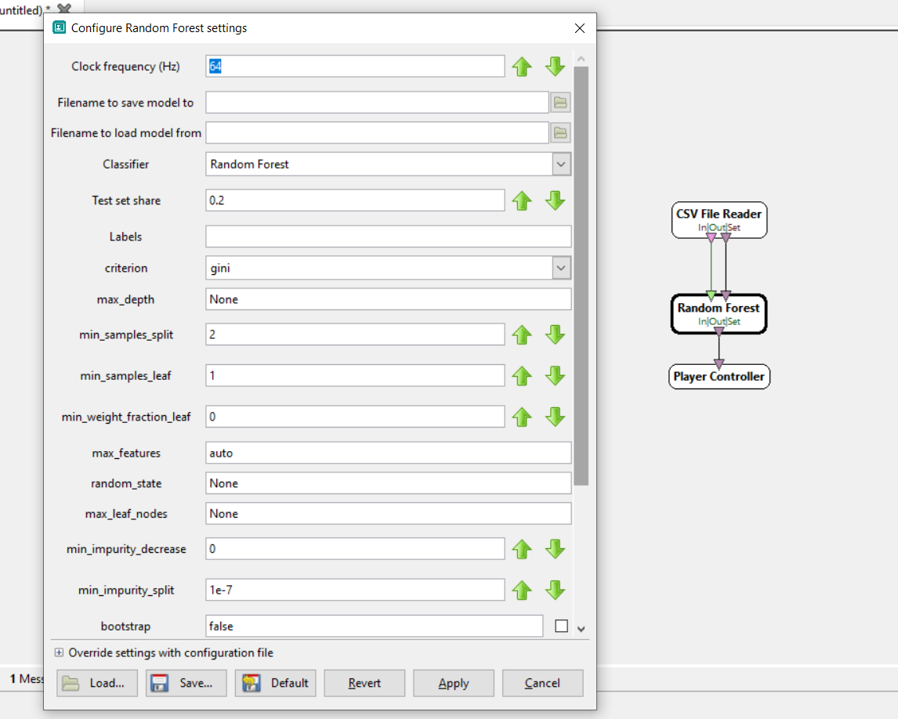
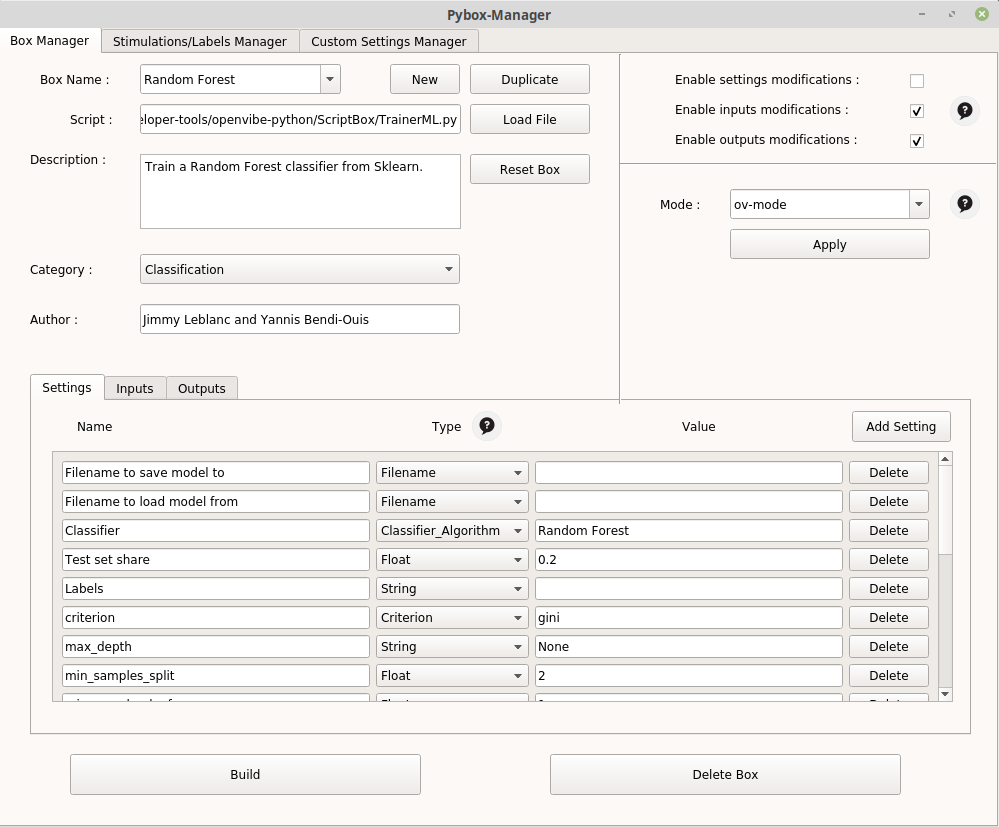
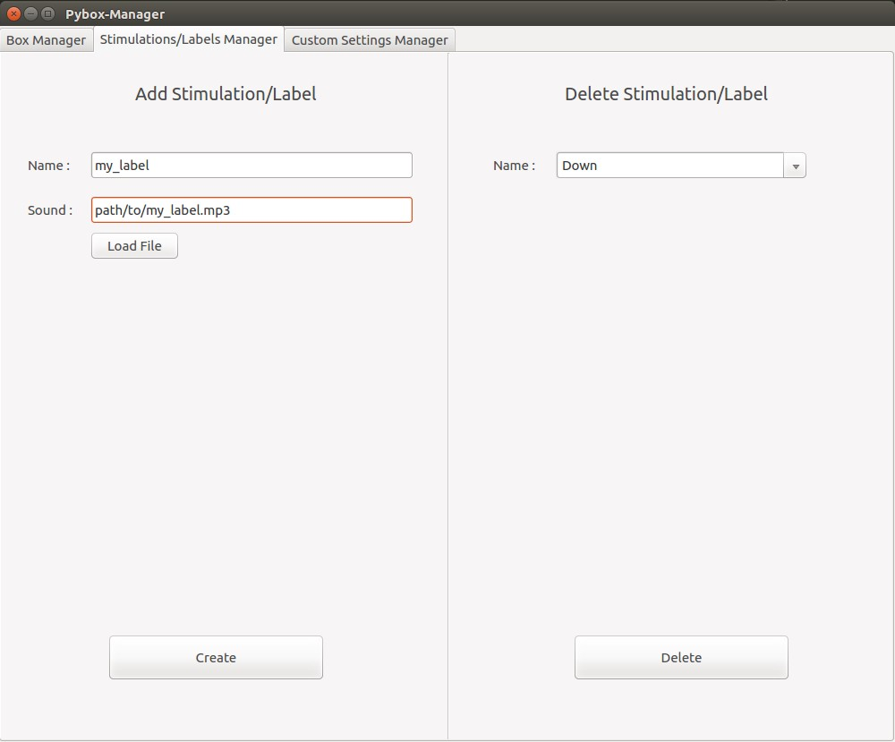
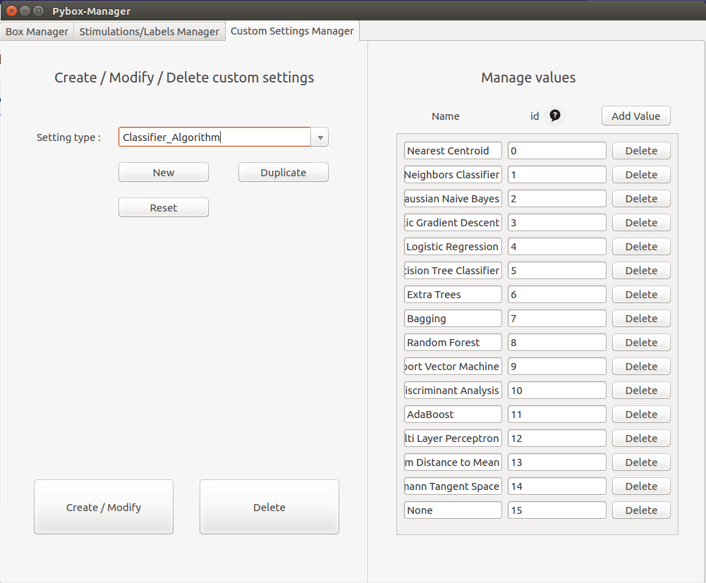
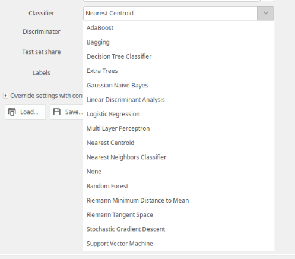
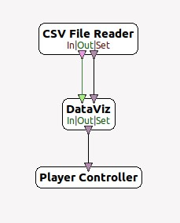
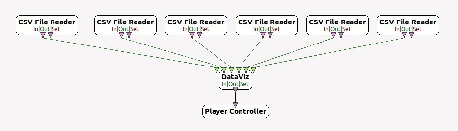

## OpenViBE Python

This Project aims to bring modifications to OpenVibe and to widen its data-oriented functionnalities. OpenVibe is a signal processing software allowing the use of machine learning algorithms, however their number is reduced. Thus, we woud like to benefit from the Openvibe Python scripting box (which allows the use of python scripts in OV) in order to allow users to use Scikit-learn Machine Learning algorithms.

## What OpenViBE Python allows 

- The use of components already implemented in OpenVibe that will allow you to :
    * The use of ML algorithms from Scikit-learn and Pyriemann (Library centered on the use of Riemannian geometry) that will allow you to train and store models.
    * Visualization of your data in 2D/3D via a PCA or LDA.
    * Easily create datasets compatible with OpenVibe's operation
- The use of a manager that allows you to simply :
    * Create new boxes in OpenVibe
    * Create new types of openvibe settings that can be used in your new boxes.
- The reuse of our scripts in order to simply implement your own python data management

## Table des matières 

- [1. Les nouvelles boites](#1-les-nouvelles-boites)
  * [Classe TrainerML / ML Boxes](#classe-trainerml---ml-boxes)
  * [Box ProcessML](#box-processml)
  * [Box DataViz](#box-dataviz)
  * [Box DatasetCreator](#box-datasetcreator)
- [2. Le Pybox Manager](#2-le-pybox-manager)
  * [Box Manager](#box-manager)
  * [Stimulations / Labels Manager](#stimulations---labels-manager)
  * [Custom Settings Manager](#custom-settings-manager)
- [3. Fonctionnement interne et détails](#3-fonctionnement-interne-et-d-tails)
  * [Notre modèle de boite : PolyBox](#notre-mod-le-de-boite---polybox)
  * [Gestion des inputs avec PolyBox, deux modes possibles](#gestion-des-inputs-avec-polybox--deux-modes-possibles)
  * [Duplication de la Python Scripting Box](#duplication-de-la-python-scripting-box)
  * [PolyBox : Stockage automatique des données](#polybox---stockage-automatique-des-donn-es)
  * [Gestion des Custom Settings](#gestion-des-custom-settings)

# 1. The new boxes 
## TrainerML Class / ML Boxes

The TrainerML class defined in TrainerML.py is a class that inherits from [PolyBox](#our-box-model-polybox), its purpose is to be used in boxes that will be configured to allow the use of certain learning machine algorithms.  The following parameters can be passed to it:

- **Filename to save model to** : Path to the file in which to save the model. If no file is indicated, then the model will not be saved.
- **Filename to load model from** : Path to the file in which the model to be loaded is saved. If a file is specified and exists, no model will be created and the model contained in the file will be loaded and used for the current session.
- **classifier** : Algorithm you wish to use. The various Algorithms are from Scikit-learn or Pyriemann. 
- **discriminator** : In case the chosen classifier is `TangentSpace`, it is necessary to provide a second algorithm which will be used to classify after the projection on the tangent space. All the previous algorithms can be used except `TangentSpace` and `MDM`. If no algorithm is specified, `LinearDiscriminantAnalysis` will be used by default.
Similarly for `MDM`, a second algorithm may be used, but is not mandatory.
- **labels**: If the read mode is Poly-Mode, you must specify the list of labels as `my label1, my label2, my label3`, otherwise, the labels will be as follows `1, 2, 3, 4, ...`. If the read mode is ov-mode, you can leave the field blank, the labels will be extracted from the stimuli.
- **Test set share**: float between 0 and 1 (1 not included) which represents the proportion of the input dataset transformed into a test set, allowing us to evaluate our model once the training on the set train is done. If 0 is filled in, then all the data will constitute the train set and no metrics will be displayed.

Here are the new algorithms / boxes implemented in OV :

#### Scikit-learn
https://scikit-learn.org/stable/

> | Box Name | Algorithm |
> | :-: | :-: | 
> | Nearest Centroid |  NearestCentroid |
> | Nearest Neighbors Classifier |  KNeighborsClassifier |
> | Gaussian Naive Bayes | GaussianNB |
> | Stochastic Gradient Descent |  SGDClassifier |
> | Logistic Regression | LogisticRegression |
> | Decision Tree Classifier |  DecisionTreeClassifier |
> | Extra Trees |  ExtraTreesClassifier |
> | Bagging |  BaggingClassifier |
> | Random Forest | RandomForestClassifier |
> | Support Vector Machine | LinearSVC |
> | Linear Discriminant Analysis |  LinearDiscriminantAnalysis |
> | AdaBoost | AdaBoostClassifier |
> | Multi Layer Perceptron | MLPClassifier |
> | Linear SVC | LinearSVC |

#### Pyriemann
https://pyriemann.readthedocs.io/en/latest/index.html
> | String | Algorithm |
> | :-: | :-: | 
> | Riemann Minimum Distance to Mean  | MDM |
> | Riemann Tangent Space | TangentSpace |

You can easily find information on each of these methods in the docs of their library. 

For each of these classifiers, an Openvibe box using TrainerML with the appropriate parameters has been created. So, if you want to train with the Random Forest algorithm of Scikit-learn for example, you just have to look for the associated box in Openvibe and you will be able to use it directly, and modify the parameters related to the algorithm. You will find the information concerning all these parameters on the respective pages of the algorithms, ex: https://scikit-learn.org/stable/modules/generated/sklearn.ensemble.RandomForestClassifier.html.

> 
>
> Example of parameterization of a box implementing Random Forest

## Box ProcessML

This box allows you to make classification predictions on new data using a previously trained model (via TrainerML or the boxes that inherit it, e.g. SVM, LDA, RandomForest ...).

- **Model Filename**: Path where the model you want to use is stored.
- **Filename to save predictions** : Path to the file where to save the predictions. If no file is specified, then the predictions will not be saved. The predictions are saved as a string where each prediction is separated from the others by a comma: `pred1,pred2,pred3 ...`.

Once the model is loaded, the predictions will be made on each chunk of data received, they can be used in real time, and if a path is given, they can be saved for later use.

#### Box DataViz

The DataViz Box allows the visualization of our data. To do this, it applies a dimension reduction via an LDA or PCA and then displays our data using the matplotlib library. It inherits from PolyBox. It requires the following parameters:

 - **Path to save the model**: Path to the file in which to save the model. If no file is specified, then the model will not be saved.
 - **Path to load the model** : Path to the file in which is saved the model you want to load. If a file is specified and exists, then no model will be created and the model contained in the file will be loaded and used for the current session.
 - **Algorithm (PCA or LDA)** : Name of the algorithm to be used to reduce dimensions. Accepted values are `PCA` or `LDA`. The default algorithm used is LDA.
 - **Dimension reduction**: Number of dimensions to display. The different possible values are 2 and 3. By default, if no number is given or if the field is filled incorrectly, the number of dimension is 2. 
 - **labels** : List of labels to indicate as `my label1, my label2, my label3` if the read mode is poly-mode. Otherwise, the labels will be in the form `1, 2, 3, 4, ...`.

 ## Box DatasetCreator

To facilitate data acquisition during our experiments, we created the python box `DatasetCreator`. This box takes a signal as an input and outputs a `OVTK_StimulationId_ExperimentStop' stimulation when it has finished creating the dataset. 

It works in the following way: the user first chooses some labels, then the box will randomly determine an order between them. It will then record the user's brain activity while verbally indicating the current action. In this way, we will be able to create a labeled dataset that can be used for learning.

The recording of an action takes place in the following way: 
1. Audible warning of the beginning of the action.
2. 2 second wait.
3. Recording for 10 seconds.
4. Audible warning of the end of the action.
5. Wait for 3 seconds.

It can be configured by indicating : 
 - The path to the directory that will contain the data.
 - The number of folds you wish to obtain. 
 - The number of actions you wish to record. That is to say 30 if you wish to obtain 30 recordings of 10 seconds distributed among the different labels.
 - The names of the labels you want to record (/!\ Attention, these names must have a corresponding mp3 file in `openvibe-python/Assets/Sounds/`, you can create new labels with the manager).
 - A boolean indicating whether you want several CSVs or only one CSV. If you enter "true", then the data will be split into as many CSVs as there are actions, one CSV per action. If you enter "false", then the data will all be recorded in a single CSV, in which the start of a new recording for a label will be indicated in the stimuli. 

# 2. The Pybox Manager

The Pybox Manager allows you to simply create and incorporate new boxes running a Python script of your choice, new labels/stimulations and new Custom Settings for your python boxes into OpenVibe.

To run it: `python pybox_manager.py`.

(Python 2.7 and python 3.X compatible.)

An option is available to enable the so-called "developer settings" i.e. the ones you created.
To do this, run the manager with the `-mode=developer` option.

## Box Manager

The Box Manager looks like this:

> 
>
> PyBox Manager.

- New: Create a new box
- Duplicate: duplicates the currently selected box.
- Reset Box: resets the selected box, cancels all changes made since the last compilation.
- Category : category in which the box will be stored in OV.
- Author : add the author's name in the box's references.
- Settings: Allows you to manage all the settings necessary to use the box. These can be types from Openvibe (String, Float etc.) or types created by yourself with the [Custom settings Manager](#)
- Inputs: Used to fill in the different inputs that your box will receive.
- Outputs : Used to fill in the different outputs that your box will send.
- Enable settings / inputs / outputs modifications : Allows you to prevent the users of your box from modifying these elements later on.
- Mode : allows you to quickly configure the inputs of your box according to the mode you want to use. [Inputs Polybox](#)

Once your modifications are finished you can press Build to have the modifications taken into account, and the compilation is done (mandatory to have your modifications and new boxes). The compilation.log file contains information from the last compilation.

Delete Box deletes the currently selected box (a compilation is necessary to take the deletion into account).

## Stimulations / Labels Manager

When reading and processing our signals, OpenViBE can handle stimulations. These can be used to label our data during a classification/training procedure.
In OpenViBE, all these stimulations are indicated in the file `meta/extras/contrib/plugins/processing/python/share/StimulationsCodes.py`. 

The DatasetCreator box we have created allows you to monitor the creation of a labeled dataset for the user. To do this, the box plays a sound during each action, indicating the action the user should think about. Basically, the user will have at his disposal about ten different labels.

We allow the user to add labels (stimulations) via the `Stimulations/Labels Manager` interface present in the manager.
To do this, the manager must provide the name of the label, and a corresponding `.mp3` file, which will be played by the DatasetCreator.

> 
>
> Add a label/stimulation to OpenViBE.

## Custom Settings Manager

The `Custom Settings Manager` allows you to create or delete special types of settings, as well as possible values for these settings, according to your needs.

This is especially useful to allow easy use on OpenVibe using a drop-down list. For example, if you want to be able to choose one algorithm among several, directly in your OpenVibe box configuration, you just have to create this new type as well as the associated values via the manager as shown in the following illustration.

To be able to use them with the manager when defining the parameters of a box, you have to launch the manager with the option `mode=developer`.

> 
>
> Add/Remove/Manage Custom Settings.

Result in OpenVibe :

> 
>
> Example with a new type 'classifier'.

# 3. Fonctionnement interne et détails
## Notre modèle de boite : PolyBox

Pour nos développement nous nous sommes servis du fichier `openvibe.py` déjà existant pour l'utilisation de la Python Scripting Box.

Pour faciliter nos phases de développement, nous avons ajouté à `openvibe.py` une classe appelée `PolyBox`. Cette dernière hérite de la classe OVBox. Elle automatise la réception et le stockage d'un signal en entrée et permet le développement de méthodes simples appelées à des moments clés :
 - **on_initialize(self) :** appelée à l'initialisation, cette méthode a pour but de permettre à l'utilisateur de définir un comportement particulier lors de l'initialisation.
 - **on_header_received(self, header) :** appelée à chaque réception d'un header, cette méthode a pour but de permettre à l'utilisateur de définir un comportement particulier lors de la réception d'un header.
 -  **on_chunk_received(self, chunk, label, shape) :** appelée à chaque réception d'un chunk, cette méthode a pour but de permettre à l'utilisateur de définir un comportement particulier lors de la réception d'un chunk.
 - **on_end_box(self) :** appelée juste avant que la box finisse son travail, cette méthode a pour but de permettre à l'utilisateur de définir un comportement particulier lors de la fin de la box.

Nous avons créée cette box afin de pouvoir lui attribuer des comportements adaptés à nos cas d'utilisations, en particulier pour facilement créer des boites proposant des algorithmes de Machine Learning en se basant sur son architecture. 

# 3. Details
#### Our Box model : PolyBox

For our development we used the already existing `openvibe.py` file for the use of the Python Scripting Box.

To facilitate our development phases, we have added to `openvibe.py` a class called `PolyBox`. This class inherits from the OVBox class. It automates the reception and storage of an input signal and allows the development of simple methods called at key moments:
 - **on_initialize(self) :** called at initialization, this method aims at allowing the user to define a particular behavior during initialization.
 - **on_header_received(self, header) :** called at each reception of a header, this method aims to allow the user to define a particular behavior when receiving a header.
 - **on_chunk_received(self, chunk, label, shape) :** called at each reception of a chunk, this method aims to allow the user to define a particular behavior when receiving a chunk.
 - **on_end_box(self) :** called just before the box finishes its work, this method aims to allow the user to define a particular behavior when the box finishes.

We have created this box in order to be able to attribute behaviors adapted to our use cases, in particular to easily create boxes proposing Machine Learning algorithms based on its architecture. 

##### Input management with PolyBox, two possible modes

Any box inheriting the PolyBox automatically has two possible read modes to retrieve input data. 

The first mode (`ov-mode`) corresponds to the classic OpenViBE reading mode: the different classes are all included in the same .csv file, and we use input stimuli to separate our data into different classes. To use this mode, you just have to give the box only two inputs: 1 StreamedMatrix and 1 Stimulation.

For example:

> 
>
> **Figure 1** - ov-mode

The second mode (`poly-mode`) consists in considering as many files as there are classes, i.e. one .csv file per class. To read all these files, the box then needs to have at least as many StreamedMatrix inputs as there are different classes. To use this mode, you just have to create only StreamedMatrix inputs. 
(Often, this mode requires a `label` parameter in which to fill in the labels of our different classes in the form: `my label1, my label2, my label3`).

For example:

> 
> **Figure 2** - poly-mode

Thus, these two reading modes are transparent for the user and allow him to operate the `PolyBoxes` either with a single file containing all the actions, or with several files: one per action. 
The user doesn't need to indicate anything for the box to choose the right behavior to adopt, the box chooses its behavior according to its inputs.

#### Duplicating the Python Scripting Box

Toutes les modifications ont été faite, on peut maintenant compiler. Toutes ces étapes sont implémentées dans `openvibe-python/ov-manager.py`.

All the modifications we have made to the software are based on the duplication of the Python Scripting box. Since the latter allows the use of a python script, we decided to create a manager that allows us to automatically make changes in the OV code to duplicate the C++ files needed to duplicate the Python Scripting Box. This way, we can definitively associate a script to a box, and let the user configure it and integrate it into OpenViBE. 

Beforehand, to duplicate the Python Scripting Box, the following initialization is necessary (this initialization is automatically managed by the manager) :
 - Duplicate respectively the files `ovpCBoxAlgorithmPython.h`, `StimulationsCodes.py` and `openvibe.py` contained in `openvibe-python/Assets/BoxManager/` instead of the respective files `meta/extras/contrib/plugins/process/python/src/box-algorithms/ovpCBoxAlgorithmPython.h`, `meta/extras/contrib/plugins/process/python/share/StimulationsCodes.py` and `meta/extras/contrib/plugins/process/python/share/openvibe.py`.
 
 These files contain respectively the modifications necessary to use a single python program (even to run several python boxes), the addition of labels (Stimulations) to OV and the implementation of the `PolyBox` class which serves as a pattern to create a set of other boxes.

 Once initialization is complete, it is then possible to use the manager as many times as we want to create and configure python boxes. Each time a python box is created, the manager performs the following tasks: 

 1. Go to the root directory of the python boxes: `meta/extras/contrib/plugins/processing/python/src/`.
 2. Create the directory corresponding to the new box: `src/box-algorithms/box-name/`. Then duplicate the files `ovpNewBoxPattern.cpp` and `ovpNewBoxPattern.h` located in `openvibe-python/Assets/BoxManager/` into `ovpBoxName.cpp` and `ovpBoxName.h` respectively.
 3. 3. Insert the CIdentifier declaration into `src/ovp_defines.h`.
 4. Add to `src/ovp_main.cpp` the imports of the newly created files for the box creation as well as the declarations.
 5.  In `src/box-algorithms/ovpBoxName.h`, replace the box name and includes/declarations.
 6. In `src/box-algorithms/ovpBoxName.cpp`, replace the box name and declarations.
 7. Change the box name and description in `src/box-algorithms/ovpBoxName.h`.
 8. Set the path of the script to be executed in `src/box-algorithms/ovpBoxName.cpp`.
 9. Remove the possibility to change the path.
 10. Add the parameters of our box to `src/box-algorithms/ovpBoxName.h`.
 11. We make a small modification in `src/box-algorithms/ovpBoxName.cpp` to take into account all the box parameters.
 12. Add the box's inputs and outputs to `src/box-algorithms/ovpBoxName.h`.

All changes have been made, we can now compile. All these steps are implemented in `openvibe-python/ov-manager.py`.

##### Automatic data storage

Automatically, the box stores all received chunk in `self.data`. This can be handy if the user wants to use all the data at the end of the box (to train a learning machine model for example).
However, it is possible to prevent this behavior voluntarily. To do this, simply give as a parameter when creating the PolyBox `record=False`. By default, record is set to True.

## Managing Custom Settings

We add to `meta/sdk/toolkit/include/toolkit/ovtk_defines.h` the declaration of our new Custom Settings and to `meta/sdk/toolkit/src/ovtk_main.cpp` the creation of the custom setting and the declaration of its different values.

