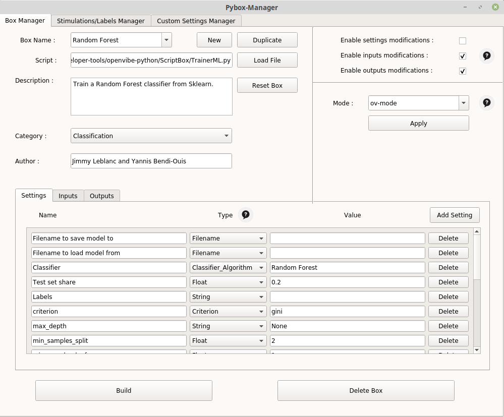
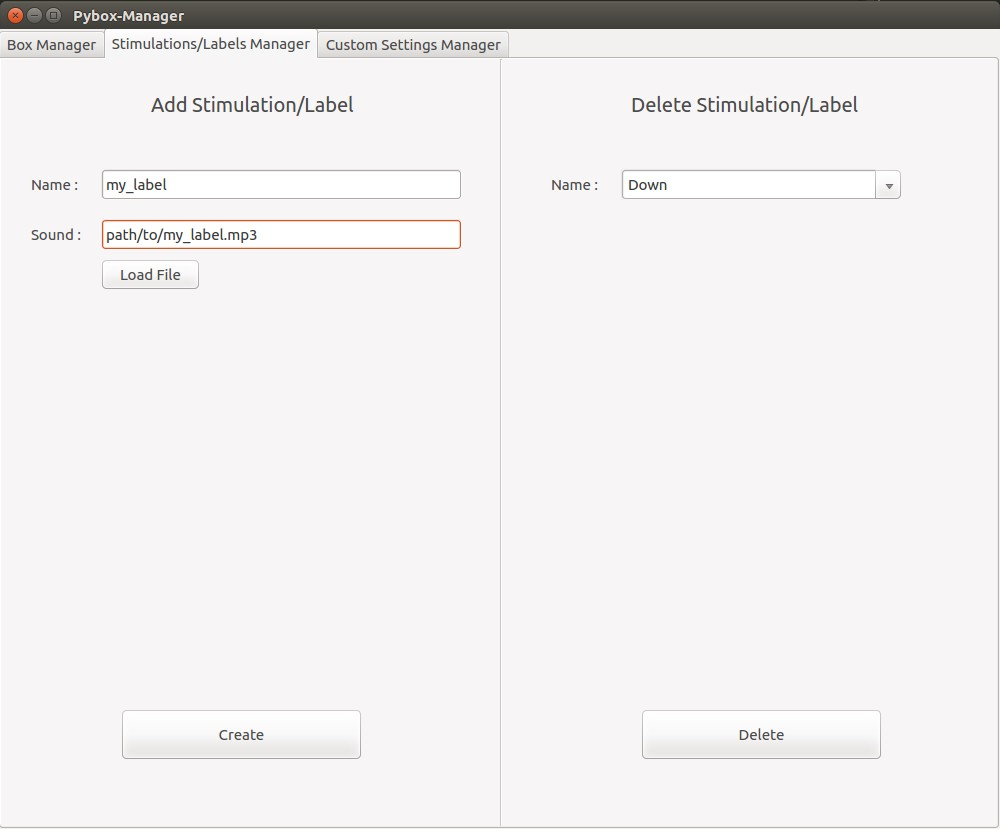
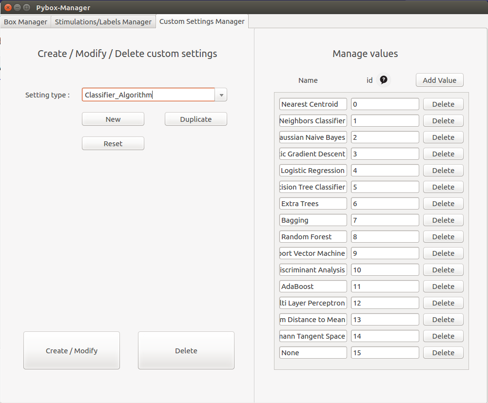
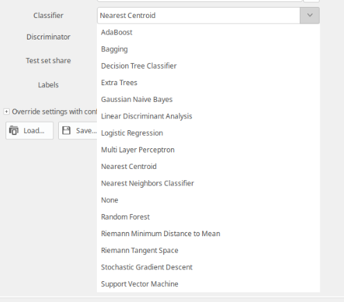

# OpenViBE Python

Ce projet a pour but d'apporter des modifications à OpenViBE et d'ouvrir ses possibilités d'un point de vue Data Science. OpenViBE est un logiciel de traitement du signal permettant l'utilisation d'algorithmes de machine learning, cependant ces algorithmes sont limités en choix. Ainsi, nous souhaitons utiliser l'ouverture laissée par la Python scripting box d'OpenViBE (qui permet d'utiliser des scripts python dans OV) pour permettre aux utilisateurs d'utiliser les algorithmes implémentés par des librairies tierces.

## Ce que permet OpenViBE Python 

- L'utilisation de composants déjà implémentés dans OpenVibe qui vous permettront :
    * l'utilisation d'algorithmes de ML issus de Scikit-learn ainsi que Pyriemann (Librarie centrée sur l'utilisation de la géométrie Riemannienne) qui vous permettront d'entrainer et de stocker des modèles.
    * La visualisation de vos données en 2D/3D via une PCA ou une LDA.
    * Créer facilement des datasets compatibles avec le fonctionnement d'OpenVibe
- L'utilisation d'un manager qui permet de simplement :
    * Créer des nouvelles boites dans OpenVibe
    * Créer des nouveaux types de "settings" openvibe qui pourront être utilisés dans vos nouvelles boites
- La réutilisation de nos scripts afin d'implenter simplement votre propre gestion de la donnée en python

## Table des matières 

- [1. Les nouvelles boites](#1-les-nouvelles-boites)
  * [Classe TrainerML / ML Boxes](#classe-trainerml---ml-boxes)
  * [Box ProcessML](#box-processml)
  * [Box DataViz](#box-dataviz)
  * [Box DatasetCreator](#box-datasetcreator)
- [2. Le Pybox Manager](#2-le-pybox-manager)
  * [Box Manager](#box-manager)
  * [Stimulations / Labels Manager](#stimulations---labels-manager)
  * [Custom Settings Manager](#custom-settings-manager)
- [3. Fonctionnement interne et détails](#3-fonctionnement-interne-et-d-tails)
  * [Notre modèle de boite : PolyBox](#notre-mod-le-de-boite---polybox)
  * [Gestion des inputs avec PolyBox, deux modes possibles](#gestion-des-inputs-avec-polybox--deux-modes-possibles)
  * [Duplication de la Python Scripting Box](#duplication-de-la-python-scripting-box)
  * [PolyBox : Stockage automatique des données](#polybox---stockage-automatique-des-donn-es)
  * [Gestion des Custom Settings](#gestion-des-custom-settings)

# 1. Les nouvelles boites 
## Classe TrainerML / ML Boxes

La classe TrainerML définie dans TrainerML.py est une classe qui hérite de [PolyBox](#notre-modèle-de-boite-polybox), son but est d'être utilisée dans des boîtes qui vont être paramétrées afin de permettre l'utilisation  de certains algorithmes de machine learning.  On peut lui passer les paramètres suivants :

- **Filename to save model to** : Chemin vers le fichier dans lequel sauvegarder le modèle. Si aucun fichier n'est indiqué, alors le modèle ne sera pas enregistré.
- **Filename to load model from** : Chemin vers le fichier dans lequel est sauvegardé le modèle que l'on souhaite charger. Si un fichier est renseigné et qu'il existe, aucun modèle ne sera créé et le modèle contenu dans le fichier sera chargé et utilisé pour la session en cours.
- **classifier** : Algorithme que l'on souhaite utiliser. Les différents Algorithmes sont issus de Scikit-learn ou bien de Pyriemann. 
- **discriminator** : Dans le cas où le classifier choisi est `TangentSpace`, il est nécessaire de fournir un second algorithme qui servira de classifier après la projection sur l'espace tangent. Tous les algorithmes précédents peuvent être utilisés sauf `TangentSpace` et `MDM`. Si aucun algorithme n'est indiqué, `LinearDiscriminantAnalysis` sera utilisé par défault.
De même pour `MDM`, un second algorithme peut être utilisé, mais n'est pas obligatoire.
- **labels** : Si le mode de lecture est Poly-Mode, vous devez indiquer la liste de labels sous la forme `mon label1, mon label2, mon label3`, sinon, les labels seront de la forme `1, 2, 3, 4, ...`. Si le mode de lecture est ov-mode, vous pouvez laissez le champs vide, les labels seront extraits des stimulations.
- **Test set share** : float compris entre 0 et 1 (1 non inclus) qui représente la proportion du dataset d'entrée transformée en test set, nous permettant d'évaluer notre modèle une fois l'entrainement sur le train set effectué. Si 0 est renseigné, alors toutes les données constitueront le train set et aucune métrique ne sera affichée.

Voici les nouveaux algorithmes / boites implémentés dans OV : 

#### Scikit-learn
https://scikit-learn.org/stable/

> | Nom de la Box | Algorithme |
> | :-: | :-: | 
> | Nearest Centroid |  NearestCentroid |
> | Nearest Neighbors Classifier |  KNeighborsClassifier |
> | Gaussian Naive Bayes | GaussianNB |
> | Stochastic Gradient Descent |  SGDClassifier |
> | Logistic Regression | LogisticRegression |
> | Decision Tree Classifier |  DecisionTreeClassifier |
> | Extra Trees |  ExtraTreesClassifier |
> | Bagging |  BaggingClassifier |
> | Random Forest | RandomForestClassifier |
> | Support Vector Machine | LinearSVC |
> | Linear Discriminant Analysis |  LinearDiscriminantAnalysis |
> | AdaBoost | AdaBoostClassifier |
> | Multi Layer Perceptron | MLPClassifier |
> | Linear SVC | LinearSVC |

#### Pyriemann
https://pyriemann.readthedocs.io/en/latest/index.html
> | String | Algorithme |
> | :-: | :-: | 
> | Riemann Minimum Distance to Mean  | MDM |
> | Riemann Tangent Space | TangentSpace |

Vous trouverez facilement des informations sur chacune de ces méthodes dans la doc de leur librairies. 

Pour chacun de ces classifiers, une boite Openvibe utilisant TrainerML avec les paramètres adéquats a été créé. Ainsi, si vous souhaitez réaliser un entrainement avec l'algorithme Random Forest de Scikit-learn par exemple, il vous suffit de chercher la boite associée dans Openvibe et vous pourrez directement l'utiliser, et modifier les paramètres relatifs à l'algorithme. Vous trouverez les informations concernant tous ces paramètres sur les pages respectives des algorithmes, ex : https://scikit-learn.org/stable/modules/generated/sklearn.ensemble.RandomForestClassifier.html

> 
>
> Exemple de paramétrisation d'une boite implémentant Random Forest

## Box ProcessML

Cette box permet de réaliser des prédictions de classification sur des nouvelles données en utilisant un modèle préalablement entraîné (via TrainerML ou les boites qui en héritent, e.g. SVM, LDA, RandomForest ... ) 

- **Model Filename** : Chemin où le modèle que l'on souhaite utiliser est stocké.
- **Filename to save predictions** : Chemin vers le fichier dans lequel sauvegarder les prédictions. Si aucun fichier n'est indiqué, alors les prédictions ne seront pas sauvegardées. Les prédictions sont enregistrées sous la forme d'une chaîne de caractère où chaque prédiction est séparée des autres par une virgule : `pred1,pred2,pred3 ...`

Une fois le modèle chargé, les prédictions seront réalisées sur chaque chunk de donnée reçu, elles pourront être utilisées en temps réel, et si un chemin est indiqué, elles pourront être sauvegardées pour un usage ultérieur.

## Box DataViz

La Box DataViz permet la visualisation de nos données. Pour ce faire, elle applique une réduction de dimension via une LDA ou une PCA, puis affiche nos données en utilisant la bibliothèque matplotlib. Elle hérite de PolyBox. 
Elle nécessite les paramètres suivants :

 - **Path to save the model** : Chemin vers le fichier dans lequel sauvegarder le modèle. Si aucun fichier n'est indiqué, alors le modèle ne sera pas enregistré.
 - **Path to load the model** : Chemin vers le fichier dans lequel est sauvegardé le modèle que l'on souhaite charger. Si un fichier est renseigné et qu'il existe, aucun modèle ne sera créé et le modèle contenu dans le fichier sera chargé et utilisé pour la session en cours.
 - **Algorithm (PCA or LDA)** : Nom de l'algorithme à utiliser pour réduire les dimensions. Les valeurs acceptées sont `PCA` ou `LDA`. L'algorithme utilisé par défaut est LDA.
 - **Dimension reduction** : Nombre de dimension à afficher. Les différentes valeurs possibles sont 2 et 3. Par défaut, si aucun nombre n'est indiqué ou si le champs est mal rempli, le nombre de dimension est 2. 
 - **labels** : Si le mode de lecture est Poly-Mode, vous devez indiquer la liste de labels sous la forme `mon label1, mon label2, mon label3`, sinon, les labels seront de la forme `1, 2, 3, 4, ...`. Si le mode de lecture est ov-mode, vous pouvez laissez le champs vide, les labels seront extraits des stimulations.

## Box DatasetCreator

Pour faciliter l'acquisition de données lors de nos expériences, nous avons créé la box python `DatasetCreator`. Cette dernière prend en entrée un signal et émet en sortie une stimulation de type `OVTK_StimulationId_ExperimentStop` lorsqu'elle a fini de créer le dataset. 

Elle fonctionne de la manière suivante : l'utilisateur choisit au préalable certains labels, puis la box va aléatoirement déterminer un ordre entre ceux-ci. Elle va ensuite monitorer l'utilisateur sur les actions à penser en indiquant oralement l'action courante. De cette manière, nous allons pouvoir créer un jeu de données labelisées qui pourra être utilisé pour de l'apprentissage.

L'enregistrement d'une action se déroule de la manière suivante : 
1. Avertissement sonore du début de l'action.
2. Attente de 2 secondes.
3. Enregistrement pendant 10 secondes.
4. Avertissement sonore de la fin de l'action.
5. Attente de 3 secondes.

On peut la configurer en indiquant : 
 - Le path jusqu'au répertoire devant contenir les données.
 - Le nombre de folds que l'on souhaite obtenir. 
 - Le nombre d'action que l'on souhaite enregistrer. C'est à dire 30 si vous souhaitez obtenir 30 enregistrement de 10 secondes répartis parmi les différents labels.
 - Le nom des labels que vous souhaitez enregistrer. (/!\ Attention, ces noms doivent avoir un fichier mp3 correspondant dans `pybox-manager/Assets/Sounds/`, vous pouvez créer de nouveaux labels avec le manager.)
 - Un boolean indiquant si vous souhaitez plusieurs CSV ou un seul CSV. Si vous renseignez "true",  alors les données seront réparties en autant de CSV qu'il y a d'action, un CSV par action. Si vous renseignez "false", alors les données seront toutes enregistrées en un seul CSV, dans lequel le début d'un nouvel enregistrement pour un label sera indiqué dans les stimulations. 

# 2. Le Pybox Manager

Le Pybox Manager permet de simplement créer et incorporer à OpenVibe de nouvelles boites éxécutant un script Python de votre choix, de nouveaux labels/stimulations et de nouveau Custom Settings pour vos box python.

Pour l'éxécuter : `python pybox_manager.py`

(Compatible python 2.7 et python 3.X.)

Une option est disponible pour activer les settings dit "développeurs" c-à-d ceux que vous avez créés.
Pour ceci lancer le manager avec l'option `mode=developer`

## Box Manager

Le Box Manager se présente comme ceci :

> 
>
> Visualisation du PyBox Manager.

- New : Créer une nouvelle boite
- Duplicate : duplique la boite actuellement séléctionnée.
- Reset Box : réinitialise la box séléctionnée, annule toutes les modifications effectuées depuis la dernière compilation.
- Category : catégorie dans laquelle la boîte sera rangée dans OV.
- Author : ajoute le nom des auteurs dans les références de la boite.
- Settings : Permet d'administrer tous les settings nécessaires afin d'utiliser la box. Ceux-ci peuvent être des types issus d'Openvibe (String, Float etc.) ou bien des types créés par vous même grâce au [Custom settings Manager](#)
- Inputs : Sert à renseigner les différents inputs que va recevoir votre boite
- Outputs : : Sert à renseigner les différents outputs que va envoyer votre boite.
- Enable settings / inputs / outputs modifications : permet d'empêcher les utilisateurs de votre boite de modifier ultérieurement ces éléments.
- Mode : permet de configurer rapidement les inputs de votre box selon le mode que vous souhaitez utiliser. [Inputs Polybox](#)

Une fois que vos modifications sont terminées vous pouvez appuyer sur Build pour que les modifications soient prises en compte, et que la compilation s'effectue (obligatoire pour avoir vos modifications et nouvelles boites). Le fichier compilation.log contient les informations issus de la dernière compilation.

Delete Box supprime la boite actuellement séléctionnée (une compilation est nécéssaire pour prendre la suppression en compte)

## Stimulations / Labels Manager

Lors de la lecture et du traitement de nos signaux, OpenViBE peut gérer des stimulations. Ces dernières peuvent servir à indiquer le label de nos données lors d'une procédure de classification/entraînement.
L'ensemble de ces stimulations sont indiquées dans le fichier `pybox-manager/share/PolyStimulations.py`. 

La box DatasetCreator que nous avons créée permet de monitorer la création d'un dataset labelisé pour l'utilisateur. Pour ce faire, la box joue un son lors de chaque action, indiquant l'action auquel l'utilisateur doit penser. De base, l'utilisateur aura a disposition une dizaine de labels différents.

Nous permettons à l'utilisateur d'ajouter des labels (stimulations) via l'interface `Stimulations/Labels Manager` présent dans le manager.
Pour ce faire, ce dernier doit fournir le nom du label, et un fichier `.mp3` correspondant, qui sera joué par le DatasetCreator.

> 
>
> Add a label/stimulation to OpenViBE.

## Custom Settings Manager

Le `Custom Settings Manager` permet de créer ou de supprimer des types de paramètres spéciaux, ainsi que des valeurs possibles pour ces paramètres, selon vos besoins.
C'est notamment utile pour permettre une utilisation facile sur OpenVibe à l'aide d'une liste déroulante. Par exemple, vous voulez pouvoir choisir un algorithme parmis plusieurs, directement dans la configuration de votre boite sur openvibe, il vous suffit de créer ce nouveau type ainsi que les valeurs associées via le manager comme dans l'illustration suivante.

Pour pouvoir les utiliser avec le manager lors de la définition des paramètres d'une box, il faut lancer le manager avec l'option `mode=developer`.

> 
>
> Add/Remove/Manage Custom Settings.

Résultat dans OpenVibe :

> 
>
> Exemple avec un nouveau type 'classifier'.

# 3. Fonctionnement interne et détails
## Notre modèle de boite : PolyBox

Pour faciliter nos phases de développement, nous avons ajouté dans `pybox-manager/share/PolyBox.py` une classe appelée `PolyBox`. Cette dernière hérite de la classe OVBox. Elle automatise la réception et le stockage d'un signal en entrée et permet le développement de méthodes simples appelées à des moments clés :
 - **on_initialize(self) :** appelée à l'initialisation, cette méthode a pour but de permettre à l'utilisateur de définir un comportement particulier lors de l'initialisation.
 - **on_header_received(self, header) :** appelée à chaque réception d'un header, cette méthode a pour but de permettre à l'utilisateur de définir un comportement particulier lors de la réception d'un header.
 -  **on_chunk_received(self, chunk, label, shape) :** appelée à chaque réception d'un chunk, cette méthode a pour but de permettre à l'utilisateur de définir un comportement particulier lors de la réception d'un chunk.
 - **on_end_box(self) :** appelée juste avant que la box finisse son travail, cette méthode a pour but de permettre à l'utilisateur de définir un comportement particulier lors de la fin de la box.

Nous avons créée cette box afin de pouvoir lui attribuer des comportements adaptés à nos cas d'utilisations, en particulier pour facilement créer des boites proposant des algorithmes de Machine Learning en se basant sur son architecture. 

## Gestion des inputs avec PolyBox, deux modes possibles

Toute box héritant de la PolyBox possède automatiquement deux modes de lectures possibles pour récupérer des données en entrée. 

Le premier mode (`ov-mode`) correspond au mode de lecture classique de OpenViBE : les différentes classes sont toutes comprises dans un même fichier .csv, et on utilise des stimulations reçues en entré pour séparer nos données en différentes classes. Pour utiliser ce mode, il suffit de n'accorder à la box que deux inputs : 1 StreamedMatrix et 1 Stimulation.

Exemple :

> 
>
> ov-mode

Le second mode (`poly-mode`) consiste à considérer autant de fichiers qu'il y a de classes, soit un fichier .csv par classe. Pour lire tous ces fichiers, la box a alors besoin d'avoir au moins autant d'input StreamedMatrix qu'il existe de classes différentes. Pour utiliser ce mode, il suffit donc de ne créer que des entrées StreamedMatrix. 
(Souvent, ce mode nécessite un paramètre `label` dans lequel renseigner les labels de nos différentes classes sous la forme : `mon label1, mon label2, mon label3`.)

Exemple :

> 
> poly-mode

Ainsi, ces deux modes de lectures sont transparents pour l'utilisateur et lui permettent d'exploiter les box `PolyBox` soit avec un seul fichier contenant l'ensemble des actions, soit avec plusieurs fichiers : un par action. 
L'utilisateur n'a donc rien besoin d'indiquer pour que la box choisisse le bon comportement à adopter, celle-ci choisit son comportement en fonction de ses inputs.

## Duplication de la Python Scripting Box

L'ensemble des modifications que nous avons apportées au logiciel repose sur la duplication de la box Python Scripting. Cette dernière permettant l'utilisation d'un script python, nous avons décidé de créer un manager permettant d'effectuer automatiquement des modifications dans le code d'OV pour dupliquer les fichiers C++ nécessaires à la duplication de la Python Scripting Box. De cette manière, nous pouvons associer définitivement un script à une box, et laisser l'utilisateur la configurer et l'intégrer à OpenViBE. 

Lors de chaque création de box python, le manager effectue les tâches suivantes : 

 1. On se place à dans le dossier racine des box python : `pybox-manager/src/`.
 2. On duplique `pybox-manager/Assets/BoxManager/NewBoxPattern-skeletton.h` en `box-algorithms/ovpBoxName.h`
 3. On insère dans `src/ovp_defines.h` la déclaration des CIdentifier.
 4. On ajoute dans `src/ovp_main.cpp` les imports des fichiers récemment créés pour la création de la box ainsi que les déclarations.
 5.  On remplace dans `src/box-algorithms/ovpBoxName.h` le nom de la boite et celui des includes/déclarations.
 6. On change le nom, la description, les auteurs et la catégorie de la boite dans `src/box-algorithms/ovpBoxName.h`.
 7. On définit le path du script à éxécuter dans `src/box-algorithms/ovpBoxName.h`.
 8. On efface la possibilité de modifier le path.
 9. On ajoute les paramètres de notre boite dans `src/box-algorithms/ovpBoxName.h`
 10. On ajoute dans `src/box-algorithms/ovpBoxName.h` les inputs et outputs de la boite.

## PolyBox : Stockage automatique des données

Automatiquement, les box héritant de PolyBox stockent tous les chunk reçus dans `self.data`. Cela peut s'avérer pratique si l'utilisateur souhaite utiliser l'ensemble des données à la fin de la boite (pour entraîner un modèle de machine learning par exemple).
Il est cependant possible d'empêcher ce comportement. Pour ce faire, il suffit de donner comme paramètre lors de la création de la PolyBox `record=False`. Par défaut, record est à True.

## Gestion des Custom Settings

On ajoute à `meta/sdk/toolkit/include/toolkit/ovtk_defines.h` la déclaration de nos nouveaux Custom Settings et à `meta/sdk/toolkit/src/ovtk_main.cpp` la création du custom setting ainsi que la déclaration de ses différentes valeurs.

