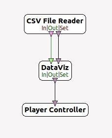
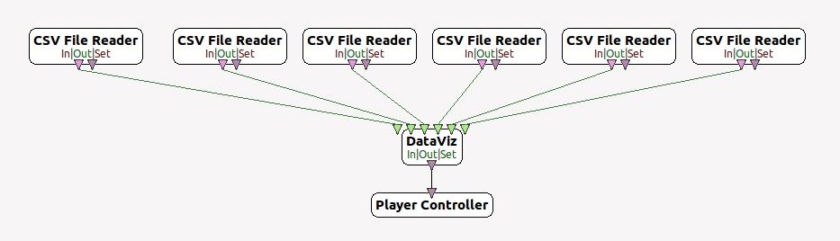

## OpenViBE Python

This Project aims to bring modifications to OpenVibe and to widen its data-oriented functionnalities. OpenVibe is a signal processing software allowing the use of machine learning algorithms, however their number is reduced. Thus, we woud like to benefit from the Openvibe Python scripting box (which allows the use of python scripts in OV) in order to allow users to use Scikit-learn Machine Learning algorithms.

#### Duplicating the Python Scripting Box

Toutes les modifications ont été faite, on peut maintenant compiler. Toutes ces étapes sont implémentées dans `openvibe-python/ov-manager.py`.

All the modifications we have made to the software are based on the duplication of the Python Scripting box. Since the latter allows the use of a python script, we decided to create a manager that allows us to automatically make changes in the OV code to duplicate the C++ files needed to duplicate the Python Scripting Box. This way, we can definitively associate a script to a box, and let the user configure it and integrate it into OpenViBE. 

Beforehand, to duplicate the Python Scripting Box, the following initialization is necessary (this initialization is automatically managed by the manager) :
 - Duplicate respectively the files `ovpCBoxAlgorithmPython.h`, `StimulationsCodes.py` and `openvibe.py` contained in `openvibe-python/Assets/BoxManager/` instead of the respective files `meta/extras/contrib/plugins/process/python/src/box-algorithms/ovpCBoxAlgorithmPython.h`, `meta/extras/contrib/plugins/process/python/share/StimulationsCodes.py` and `meta/extras/contrib/plugins/process/python/share/openvibe.py`.
 
 These files contain respectively the modifications necessary to use a single python program (even to run several python boxes), the addition of labels (Stimulations) to OV and the implementation of the `PolyBox` class which serves as a pattern to create a set of other boxes.

 Once initialization is complete, it is then possible to use the manager as many times as we want to create and configure python boxes. Each time a python box is created, the manager performs the following tasks: 

 1. Go to the root directory of the python boxes: `meta/extras/contrib/plugins/processing/python/src/`.
 2. Create the directory corresponding to the new box: `src/box-algorithms/box-name/`. Then duplicate the files `ovpNewBoxPattern.cpp` and `ovpNewBoxPattern.h` located in `openvibe-python/Assets/BoxManager/` into `ovpBoxName.cpp` and `ovpBoxName.h` respectively.
 3. 3. Insert the CIdentifier declaration into `src/ovp_defines.h`.
 4. Add to `src/ovp_main.cpp` the imports of the newly created files for the box creation as well as the declarations.
 5.  In `src/box-algorithms/ovpBoxName.h`, replace the box name and includes/declarations.
 6. In `src/box-algorithms/ovpBoxName.cpp`, replace the box name and declarations.
 7. Change the box name and description in `src/box-algorithms/ovpBoxName.h`.
 8. Set the path of the script to be executed in `src/box-algorithms/ovpBoxName.cpp`.
 9. Remove the possibility to change the path.
 10. Add the parameters of our box to `src/box-algorithms/ovpBoxName.h`.
 11. We make a small modification in `src/box-algorithms/ovpBoxName.cpp` to take into account all the box parameters.
 12. Add the box's inputs and outputs to `src/box-algorithms/ovpBoxName.h`.

All changes have been made, we can now compile. All these steps are implemented in `openvibe-python/ov-manager.py`.

#### DatasetCreator Box 

To facilitate data acquisition during our experiments, we created the python box `DatasetCreator`. This box takes a signal at the input and outputs a `OVTK_StimulationId_ExperimentStop' stimulation when it has finished creating the dataset. 

It works as follows : the user having previously chosen certain labels, the box will randomly determine an order of alternation between them, then it will pronounce them orally respecting this order. In this way, we will be able to create a labeled dataset that can be used for learning.

Once a sound has been triggered, the box waits for 2 second buffer and then records the next 10. The end of the 10 second recording is indicated to the user then 3 second buffer are added again, once the delay is over, it selects another label, and so on, until the end of the recording.

It can be configured by specifying : 
 - The path to the directory that will contain the data.
 - The number of folds you wish to obtain. 
 - The number of actions to be recorded. That is, 30 if you wish to obtain 30 10-second recordings distributed among the different labels.
 - The names of the labels you want to record (/!\ Attention, these names must have a corresponding mp3 file in `openvibe-python/Assets/Sounds/`).
 - A boolean indicating whether you want multiple CSVs or a single CSV. If you enter "true", then the data will be divided into as many CSVs as there are actions, one CSV per action. If you enter "false", then the data will all be recorded in a single CSV, in which the start of a new recording for a label will be indicated in the stimulus.

#### Our Box model : PolyBox

To facilitate our development phases, we have added to `openvibe.py` a class called `PolyBox`. This class inherits from the OVBox class. It automates the reception and storage of an input signal and allows the development of simple methods called at key moments:
 - **on_initialize(self) :** called at initialization, this method aims at allowing the user to define a particular behavior during initialization.
 - **on_header_received(self, header) :** called at each reception of a header, this method aims to allow the user to define a particular behavior when receiving a header.
 - **on_chunk_received(self, chunk, label, shape) :** called at each reception of a chunk, this method aims to allow the user to define a particular behavior when receiving a chunk.
 - **on_end_box(self) :** called just before the box finishes its work, this method aims to allow the user to define a particular behavior when the box finishes.

We have created this box in order to be able to attribute behaviors adapted to our use cases, in particular to easily create boxes proposing Machine Learning algorithms based on its architecture. 

##### Automatic data storage

Automatically, the box stores all received chunk in `self.data`. This can be handy if the user wants to use all the data at the end of the box (to train a learning machine model for example).
However, it is possible to prevent this behavior voluntarily. To do this, simply give as a parameter when creating the PolyBox `record=False`. By default, record is set to True.

##### Input management with PolyBox, two possible modes

Any box inheriting the PolyBox automatically has two possible read modes to retrieve input data. 

The first mode (`ov-mode`) corresponds to the classic OpenViBE reading mode: the different classes are all included in the same .csv file, and we use input stimuli to separate our data into different classes. To use this mode, you just have to give the box only two inputs: 1 StreamedMatrix and 1 Stimulation.

For example:

> 
>
> **Figure 1** - ov-mode

The second mode (`poly-mode`) consists in considering as many files as there are classes, i.e. one .csv file per class. To read all these files, the box then needs to have at least as many StreamedMatrix inputs as there are different classes. To use this mode, you just have to create only StreamedMatrix inputs. 
(Often, this mode requires a `label` parameter in which to fill in the labels of our different classes in the form: `my label1, my label2, my label3`).

For example:

> 
> **Figure 2** - poly-mode

Thus, these two reading modes are transparent for the user and allow him to operate the `PolyBoxes` either with a single file containing all the actions, or with several files: one per action. 
The user doesn't need to indicate anything for the box to choose the right behavior to adopt, the box chooses its behavior according to its inputs.

#### Box TrainerML

The TrainerML box is the box that allows us to use some learning machine algorithms from sklearn. This box inherits from PolyBox and requires the following parameters:

- **Filename to save model to** : Path to the file in which to save the model. If no file is indicated, then the model will not be saved.
- **Filename to save configuration to** : Path to the file in which to save the configuration of the algorithm. If no file is specified, then the configuration will not be saved.
- **Filename to load model from** : Path to the file in which the model to be loaded is saved. If a file is specified and exists, then no model will be created and the model contained in the file will be loaded and used for the current session.
- **classify**: Name of the algorithm you wish to use. The different possible names are :

> | Paramètre | Algorithme |
> | :-: | :-: |
> |'log_reg'| LogisticRegression|
> |'bayes'| GaussianNB|
> |'random_forest'| RandomForestClassifier|
> |'svm'| SVC|
> |'mlp'| MLPClassifier|
> |'ada'| AdaBoostClassifier|
> |'extra_trees' | ExtraTreesClassifier|
> |'bagging' | BaggingClassifier|
> |'sgd' | SGDClassifier|
> |'lda' | LinearDiscriminantAnalysis|
> |'tangent'| TangentSpace |
> |'mdm'| MDM|

 - **discriminator**: In case the chosen classifier is `TangentSpace`, it is necessary to provide a second algorithm which will be used to classify after the projection on the tangent space. All the previous algorithms can be used except `TangentSpace` and `MDM`. If no algorithm is specified, `LinearDiscriminantAnalysis` will be used by default.
 Similarly for `MDM`, a second algorithm may be used, but is not mandatory.

 - **label** : List of labels to be given as `my label1, my label2, my label3` if the read mode is multi-mode. Otherwise, the labels will be in the form `1, 2, 3, 4, ...`.

 - **Test set share**: float between 0 and 1 (1 not included) which represents the proportion of the input dataset transformed into a test set, allowing us to evaluate our model once the training on the set train is done. If 0 is filled in, then all the data will constitute the train set and no metrics will be displayed. 

#### ProcessML

This box allows you to make classification predictions on new data using a previously trained model (via TrainerML or any box which inherits from it, e.g. SVM, LDA, RandomForest ... )

- **Model Filename**: Path where the model to be used is stored.
- **Filename to save predictions** : Path to the file where to save the predictions. If no file is specified, then the predictions will not be saved. The predictions are saved as a string where each prediction is separated from the others by a comma: `pred1,pred2,pred3 ...`.

Once the model is loaded, the predictions will be made on each chunk of data received, they can be used in real time, and if a path is given, they can be saved for later use.

#### Box DataViz

The DataViz Box allows the visualization of our data. To do this, it applies a dimension reduction via an LDA or PCA and then displays our data using the matplotlib library. It inherits from PolyBox. It requires the following parameters:

 - **Path to save the model**: Path to the file in which to save the model. If no file is specified, then the model will not be saved.
 - **Path to load the model** : Path to the file in which is saved the model you want to load. If a file is specified and exists, then no model will be created and the model contained in the file will be loaded and used for the current session.
 - **Algorithm (PCA or LDA)** : Name of the algorithm to be used to reduce dimensions. Accepted values are `PCA` or `LDA`. The default algorithm used is LDA.
 - **Dimension reduction**: Number of dimensions to display. The different possible values are 2 and 3. By default, if no number is given or if the field is filled incorrectly, the number of dimension is 2. 
 - **labels** : List of labels to indicate as `my label1, my label2, my label3` if the read mode is poly-mode. Otherwise, the labels will be in the form `1, 2, 3, 4, ...`.